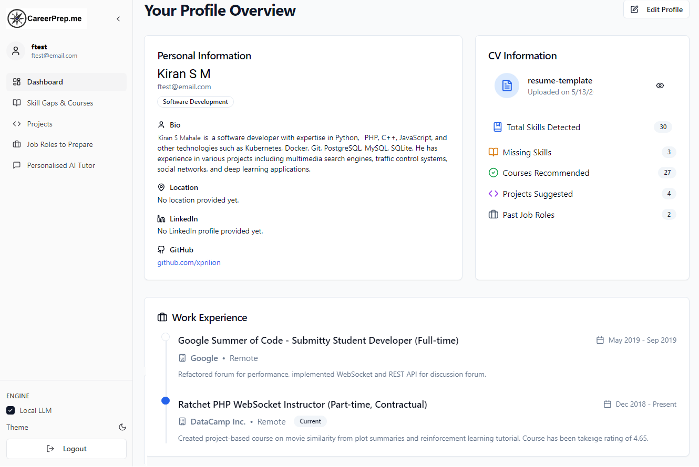

# vtu-int-spr

## Setup
Extract the Folder, and open the folder into a cmd-terminal.
### Backend - initiation
```
cd backend
pip install -r requirements.txt
uvicorn app.main:app --reload
```

### Frontend - initiation
```
cd frontend
npm install
npm run dev
```

### Launch - the Application
Open `http://localhost:8080`

### App - Main Page Screenshot


### Features

1. **BaseAuthentication**
   - Sign up, login, and JWT authentication
2. **CV Processing**
   - Upload PDF file for LLM analysis to extract skills, experience, and projects
3. **Dashboard**
   - CV overview with profile editing, skills summary, and course recommendations
4. **Skills & Courses**
   - Display own and missing skills with Coursera course recommendations and search filter
5. **Projects**
   - View CV projects and AI-suggested projects with details, AI chat, and custom project creation

6. **Job Roles**
   - Display past roles and job suggestions based on skills and experience

7. **AI Tutor**
   - Multi-conversation chat with CV context-aware AI and persistent message history
